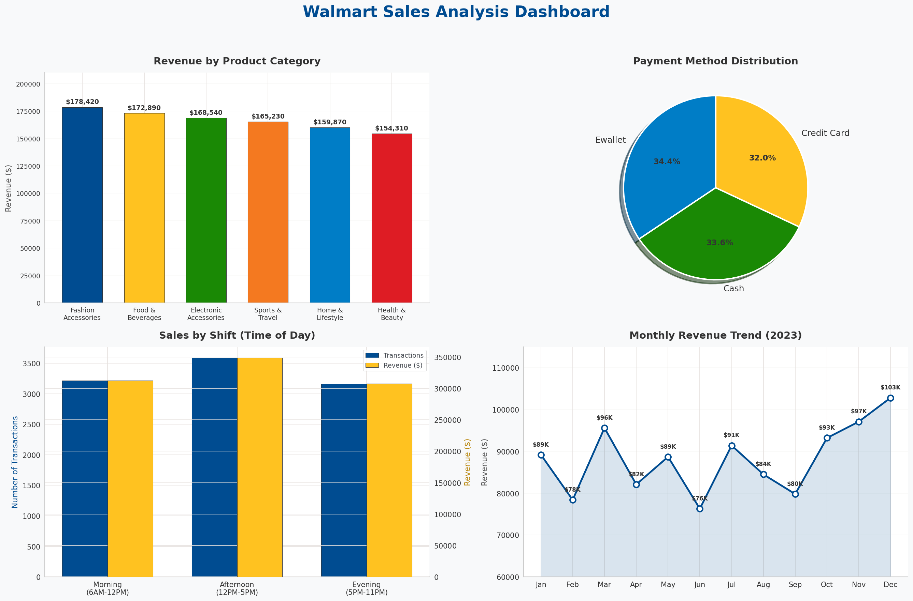

# 🛒 Walmart Sales Analysis — End-to-End Data Pipeline


> An end-to-end data analysis project exploring **10,000+ Walmart transactions** across **100 branches in Texas** — from raw data ingestion to SQL-powered business insights and interactive Tableau dashboards.

---

## 📌 Table of Contents

- [Project Overview](#-project-overview)
- [Tech Stack](#-tech-stack)
- [Dataset](#-dataset)
- [Project Pipeline](#-project-pipeline)
- [Business Problems Solved](#-business-problems-solved)
- [Executive Dashboard](#-executive-dashboard)
- [Key Insights](#-key-insights)
- [Project Structure](#-project-structure)
- [Getting Started](#-getting-started)
- [Future Enhancements](#-future-enhancements)
- [Acknowledgments](#-acknowledgments)

---

## 🎯 Project Overview

This project simulates a real-world retail analytics workflow at Walmart. It covers:

- **Data Collection** — Automated dataset download via Kaggle API
- **Data Cleaning & Transformation** — Python (Pandas) for preprocessing, handling nulls, type conversions, and feature engineering
- **Database Loading** — Structured storage in PostgreSQL using SQLAlchemy
- **SQL Analysis** — 15 strategic business queries answering key operational questions
- **Dashboard Visualization** — Interactive Tableau dashboard for executive-level insights

---

## :bar_chart: Sales Analysis Dashboard

<p align="center">
  
</p>

---

## 🛠 Tech Stack

| Layer | Tool |
|---|---|
| Language | Python 3.8+ |
| Data Processing | Pandas, NumPy |
| Database | PostgreSQL (pgAdmin 4) |
| ORM / Connector | SQLAlchemy, psycopg2 |
| Visualization | Tableau Desktop |
| IDE | VS Code, Jupyter Notebook |
| Data Source | Kaggle API |

---

## 📊 Dataset

| Attribute | Detail |
|---|---|
| **Source** | Kaggle — Walmart Sales Dataset |
| **Records** | 10,000+ transactions |
| **Branches** | 100 stores across Texas |
| **Time Span** | January 2019 – December 2023 |
| **Categories** | Health & Beauty · Electronics · Home & Lifestyle · Food & Beverages · Sports & Travel · Fashion Accessories |
| **Payment Methods** | E-Wallet · Cash · Credit Card |

### Key Columns
`invoice_id` · `Branch` · `City` · `category` · `unit_price` · `quantity` · `date` · `time` · `payment_method` · `rating` · `profit_margin` · `total`

---

## 🔄 Project Pipeline

```
┌──────────────┐    ┌──────────────┐    ┌──────────────┐    ┌──────────────┐    ┌──────────────┐
│  Kaggle API  │───▶│  Python EDA  │───▶│  Data Clean  │───▶│  PostgreSQL  │───▶│   Tableau    │
│  Data Fetch  │    │  & Explore   │    │  & Engineer  │    │  SQL Queries │    │  Dashboard   │
└──────────────┘    └──────────────┘    └──────────────┘    └──────────────┘    └──────────────┘
```

### Step-by-Step

1. **Environment Setup** — Install Python, PostgreSQL, configure Kaggle API
2. **Data Ingestion** — Download raw dataset via `kaggle datasets download`
3. **Exploratory Analysis** — Inspect shape, dtypes, nulls, distributions with Pandas
4. **Data Cleaning** — Remove duplicates, fix missing values, clean `$` from prices, standardize date/time formats
5. **Feature Engineering** — Compute `total = unit_price × quantity`, extract year/month/day/hour features
6. **Database Loading** — Push cleaned data to PostgreSQL via SQLAlchemy
7. **SQL Analysis** — Execute 15 business queries (see below)
8. **Tableau Dashboard** — Build interactive executive dashboard

---

## 💼 Business Problems Solved

| # | Business Question | Focus Area |
|---|---|---|
| Q1 | Payment method transaction & item analysis | Customer Behavior |
| Q2 | Highest-rated category per branch | Customer Satisfaction |
| Q3 | Busiest day of week per branch | Operations |
| Q4 | Category ratings by city (avg/min/max) | Regional Strategy |
| Q5 | Total profit by category | Profitability |
| Q6 | Most common payment method per branch | Operations |
| Q7 | Sales by shift (Morning/Afternoon/Evening) | Staffing |
| Q8 | Top 5 branches with largest YoY revenue decline | Performance |
| Q9 | Top 3 categories by total revenue | Revenue |
| Q10 | Average profit margin per branch | Profitability |
| Q11 | Monthly revenue trend for 2023 | Seasonality |
| Q12 | Top 5 branches by revenue per transaction | Efficiency |
| Q13 | Hourly sales trends | Time Optimization |
| Q14 | Top category by profit in each city | Local Strategy |
| Q15 | Month-over-month transaction growth (2023) | Growth Tracking |

---

## 📈 Executive Dashboard

> **Note:** Open the `.twb` file in Tableau Desktop to interact with the dashboard. Connect it to the cleaned dataset (`walmart_clean_data.csv`).

---

## 🔍 Key Insights

- **E-Wallet dominates** as the preferred payment method across most branches
- **Fashion Accessories** and **Home & Lifestyle** are the highest-volume categories
- **Afternoon shift** (12 PM – 5 PM) sees peak transaction volume
- **Profit margins vary** from 18% (Canyon, Weatherford) to 57% (Mansfield/Conroe) based on branch location
- **Revenue seasonality** shows notable spikes during holiday months (Nov–Dec)
- **Customer ratings** average 5.5–6.5 across categories, with Health & Beauty performing strongest

---

## 📁 Project Structure

```
Walmart_SQL_Python_Project/
│
├── 📂 data/
│   ├── walmart_raw_data.csv          # Original dataset from Kaggle
│   └── walmart_clean_data.csv        # Cleaned & transformed dataset
│
├── 📂 sql_queries/
│   └── PostgreSQL_queries.sql        # 15 business analysis SQL queries
│
├── 📂 notebooks/
│   └── project.ipynb                 # Python EDA & data cleaning notebook
│
├── 📂 dashboards/
│   └── SQL_queries_Dashboard.twb     # Tableau workbook
│
├── 📂 docs/
│   └── Walmart Business Problems.pdf # Business questions documentation
│
├── requirements.txt                  # Python dependencies
└── README.md                         # Project documentation (this file)
```

---

## 🚀 Getting Started

### Prerequisites
- Python 3.8+
- PostgreSQL installed (with pgAdmin 4)
- Tableau Desktop (for dashboard)
- Kaggle account (for API access)

### Installation

```bash
# Clone the repository
git clone https://github.com/Nikita-Dongre/Walmart_SQL_Python_Project.git

# Navigate to the project directory
cd Walmart_SQL_Python_Project

# Install Python dependencies
pip install -r requirements.txt
```

### Kaggle API Setup

```bash
# Download kaggle.json from: Kaggle → Account → Create New API Token

# macOS/Linux
mkdir -p ~/.kaggle && mv ~/Downloads/kaggle.json ~/.kaggle/

# Windows
mkdir %USERPROFILE%\.kaggle
copy %USERPROFILE%\Downloads\kaggle.json %USERPROFILE%\.kaggle\
```

### Run the Project

1. Open `project.ipynb` in Jupyter/VS Code and run all cells
2. Load `PostgreSQL_queries.sql` in pgAdmin 4 and execute
3. Open `SQL_queries_Dashboard.twb` in Tableau Desktop

---

## 🔮 Future Enhancements

- [ ] Automate the full pipeline with Apache Airflow
- [ ] Add predictive models for demand forecasting
- [ ] Deploy Tableau dashboard to Tableau Public for web access
- [ ] Integrate real-time data feeds
- [ ] Add customer segmentation analysis (RFM)

---

## 🙏 Acknowledgments

- **Data Source:** [Kaggle — Walmart Sales Dataset](https://www.kaggle.com/)
- **Tools:** Python, PostgreSQL, Tableau
- **Inspiration:** Walmart's real-world supply chain and retail optimization strategies

---

<p align="center">
  <b>⭐ If you found this project useful, give it a star! ⭐</b>
</p>
